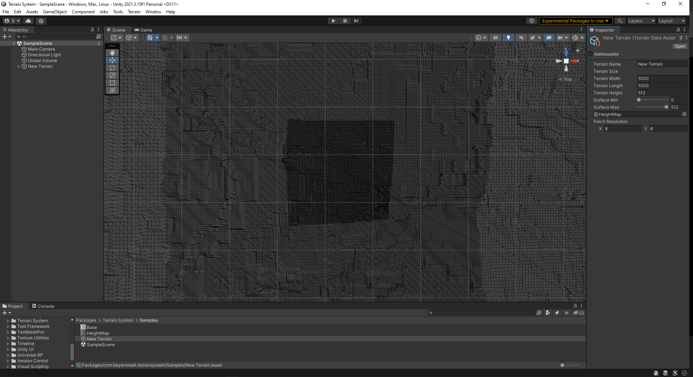

# **_Terrain System_**

### _Description_
This Package aims to deliver a Terrain System for procedurally generating alterable Terrains using 2D Mesh generation for simpler terrains or "Marching Cubes" and "Dual Contouring" Algorithms to generate 3D Voxel Terrains.
Right click 'Project View' -> 'TerrainSystem' -> 'New Terrain' to create a new Terrain Asset and setup its data. 
Drag and Drop the new Terrain Asset from Project View to Scene View.

### _Required Packages_
- Unity Universal Render Pipeline
This Package is built in URP
(https://docs.unity3d.com/Packages/com.unity.render-pipelines.universal@11.0/manual/)
- Unity Addressables
This Package requires Unity Addressables to conveiniently load and unload instances of ComputeShaders for hardware accellerated mesh generation
(https://docs.unity3d.com/Manual/com.unity.addressables.html)
